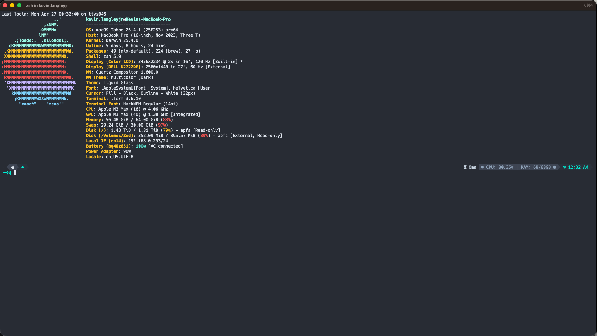

<div align="center">


<picture>
  <source media="(prefers-color-scheme: dark)" srcset="https://getslatewave.com/brand/wordmark-light.png">
  
</picture>

# Slatewave (iTerm2)

A Slatewave `.itermcolors` preset for [iTerm2](https://iterm2.com) — slate foundation, teal signature. Part of the [Slatewave family](#slatewave-family) — one palette across editors, terminals, prompts, notes, and more.

> _Slate below, teal above._



</div>

---

## What it styles

Slatewave for iTerm2 is a single `.itermcolors` preset tuned against iTerm2's full semantic slot set — not just the 16 ANSI colors. It sets:

- **ANSI 0–15** — mirrored from the VSCode Slatewave terminal block so `ls --color`, `git diff`, and 256-color TUIs all read identically across your editor and terminal
- **Cursor** — teal `#5eead4` with slate-900 text, so the box-cursor stays legible on any background
- **Selection** — teal `#5eead4` at 25% alpha, matching VSCode's `terminal.selectionBackground`
- **Link** — sky `#38bdf8` for `⌘`-click URL detection
- **Badge** — teal `#5eead4` at 50% alpha (for hostname / session badges)
- **Tab** — chrome `#21252b`, matching the VSCode activity bar
- **Cursor guide** — teal at 15% alpha (enable in Profile → Text)
- **Match background** — sky at 35% alpha, matching VSCode's find highlight
- **Underline** — teal, for OSC 8 hyperlinks and misspellings

---

## Installation

### Import the preset

1. Download [`slatewave.itermcolors`](./slatewave.itermcolors).
2. In iTerm2, open **Settings → Profiles → Colors**.
3. Click **Color Presets… → Import…** and choose the downloaded file.
4. Click **Color Presets…** again and select **slatewave**.

### From a local clone

```sh
git clone https://github.com/kevinlangleyjr/iterm2-slatewave
open iterm2-slatewave/slatewave.itermcolors
```

Opening the file with iTerm2 running will offer to import it directly.

### Recommended profile settings

For the cleanest match with the companion themes:

- **Text → Cursor** — `Box`, enable _Blinking cursor_ off
- **Text → Anti-aliased** — on
- **Text → Use bold font** — on, **Use bright colors for bold** — off (so `Bold Color` drives bold text)
- **Text → Use built-in Powerline glyphs** — on (for the oh-my-posh prompt segments)
- **Window → Transparency** — 0, **Blur** — off (slate is the intended background)
- **Terminal → Report Terminal Type** — `xterm-256color`

---

## Palette

Slatewave shares its palette with the companion themes. The anchor colors:

| | Hex | Tailwind | Role |
|---|---|---|---|
|  | `#282c34` | — | **background** |
|  | `#21252b` | — | tab color |
|  | `#1e293b` | slate-800 | ANSI 0 (black) |
|  | `#e2e8f0` | slate-200 | **foreground**, ANSI 7 (white) |
|  | `#5eead4` | teal-300 | **cursor, selection, badge, underline**, ANSI 2 (green) |
|  | `#99f6e4` | teal-200 | ANSI 10 (bright green) |
|  | `#7dd3fc` | sky-300 | ANSI 12 (bright blue) |
|  | `#38bdf8` | sky-400 | **link**, ANSI 4 (blue) |
|  | `#b388ff` | — | ANSI 5 (magenta) |
|  | `#fb7185` | rose-400 | ANSI 1 (red) |
|  | `#fbbf24` | amber-400 | ANSI 11 (bright yellow) |

### ANSI mapping

Mirrors the `terminal.ansi*` block from [vscode-slatewave](https://github.com/kevinlangleyjr/vscode-slatewave/blob/main/themes/slatewave-color-theme.json) so shell output is consistent across editor and terminal.

| Slot | Normal | Bright |
|---|---|---|
| Black | `#1e293b` slate-800 | `#475569` slate-600 |
| Red | `#fb7185` rose-400 | `#ef5350` |
| Green | `#5eead4` teal-300 | `#99f6e4` teal-200 |
| Yellow | `#b45309` amber-700 | `#fbbf24` amber-400 |
| Blue | `#38bdf8` sky-400 | `#7dd3fc` sky-300 |
| Magenta | `#b388ff` | `#c4b5fd` violet-300 |
| Cyan | `#0e7490` cyan-700 | `#67e8f9` cyan-300 |
| White | `#e2e8f0` slate-200 | `#f1f5f9` slate-100 |

---

## Customize

`.itermcolors` is just a plist. To override a single color without forking, edit your profile in **Settings → Profiles → Colors** after importing — changes take effect immediately and live in iTerm2's own `com.googlecode.iterm2.plist`, not in this file.

To fork the preset itself: open `slatewave.itermcolors` in any text editor. Each color is an sRGB dict with `Red Component` / `Green Component` / `Blue Component` / `Alpha Component` as floats 0–1.

---

## Slatewave family

One palette. Every tool.

- **Editors** — [VSCode](https://github.com/kevinlangleyjr/vscode-slatewave) · [Neovim](https://github.com/kevinlangleyjr/neovim-slatewave) · [Helix](https://github.com/kevinlangleyjr/helix-slatewave) · [Zed](https://github.com/kevinlangleyjr/zed-slatewave) · [Sublime Text](https://github.com/kevinlangleyjr/sublime-text-slatewave) · [JetBrains](https://github.com/kevinlangleyjr/jetbrains-slatewave)
- **Terminals** — [Alacritty](https://github.com/kevinlangleyjr/alacritty-slatewave) · [Ghostty](https://github.com/kevinlangleyjr/ghostty-slatewave) · [WezTerm](https://github.com/kevinlangleyjr/wezterm-slatewave) · [Windows Terminal](https://github.com/kevinlangleyjr/windows-terminal-slatewave) · [Kitty](https://github.com/kevinlangleyjr/kitty-slatewave)
- **Prompts** — [Oh My Posh](https://github.com/kevinlangleyjr/slatewave-omp) · [Starship](https://github.com/kevinlangleyjr/starship-slatewave)
- **Multiplexer** — [tmux](https://github.com/kevinlangleyjr/tmux-slatewave)
- **CLI** — [LSD](https://github.com/kevinlangleyjr/lsd-slatewave)
- **Notes** — [Obsidian](https://github.com/kevinlangleyjr/obsidian-slatewave) · [Logseq](https://github.com/kevinlangleyjr/logseq-slatewave) · [MarkEdit](https://github.com/kevinlangleyjr/markedit-slatewave) · [Anytype](https://github.com/kevinlangleyjr/anytype-slatewave)
- **Launchers** — [Alfred](https://github.com/kevinlangleyjr/alfred-slatewave) · [Raycast](https://github.com/kevinlangleyjr/raycast-slatewave)
- **Chat** — [Slack](https://github.com/kevinlangleyjr/slack-slatewave)

See [getslatewave.com](https://getslatewave.com) for the full family.
---

## Contributing

Issues and PRs welcome. For palette changes, include a before/after screenshot of the same terminal session (`ls --color`, `git diff`, a TUI like `lazygit` or `btop`) so the visual tradeoff is obvious.

---

## License

WTFPL — Do What The Fuck You Want To Public License. See [LICENSE](LICENSE).
